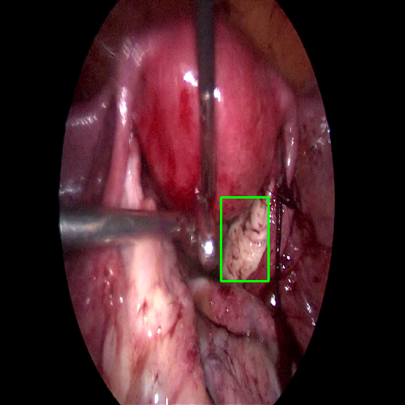
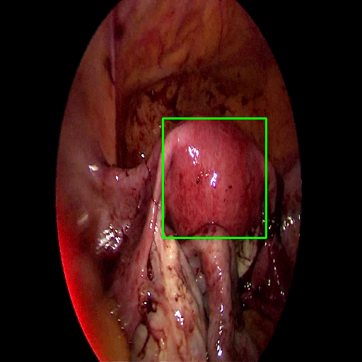

# Self-Learning

In this project, the Self-Learning methodology is proposed and evaluated by training a detection system capable of semantically segmenting and localizing human organs, such as the uterus or ovary, during laparoscopic or robotic surgery. While this method is designed with medical procedures in mind, its applications are not limited to this field and can be extended to various other domains easily.

## Ovary Detection System 

In this video, the computer demonstrates its ability to independently learn to detect the ovary within a laparoscopic video using the proposed Self-Learning methodology. Considerably, no masked or annotated images were provided to the computer during this learning process. 

## Uterus Detection System 

In this video, the computer showcases its ability to autonomously learn to detect the uterus in a laparoscopic video by following the proposed Self-Learning methodology. Notably, no masked or annotated images were provided to the computer during this learning process.

### About Me

The Self-Learning method is completely designed, conducted, and evaluated by me: 
Sina Saadati

